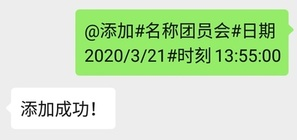

# Wechat Notification Robot

微信提醒小助手，集成在微信聊天框中的通知程序。

## Features

- 支持消息的增删查
- 支持一次性通知和定时通知
- 通过邮件报告小助手健康状况
- 登录二维码通过邮件发送，在外无需担心出状况下线

## Prerequisites
- npm
- Node.js

## Get Started
- 复制`.env.template`到`.env`，并设置相关邮箱以及备注变量
- `npm install`
- `node index.js`

## Usage
- 发送`@帮助`查看使用方法
- 发送`@所有`查看所有通知任务
- 发送`@删除 <名称>`删除通知任务
    - `<名称>`为通知任务的名称
- 发送`@添加 #名称 <名称> #时刻 <时刻> #日期 <时期> #周期 <周期> #提醒 <内容>`添加通知任务
    - `<名称>`为通知任务的名称
    - `<时刻>`格式为`HH:mm:ss`，默认为当前时刻
    - `<日期>`格式为`YYYY/MM/DD`，默认为当天
    - `<周期>`用于设置定时任务，格式为hms，比如`1h`、`20m`、`120s`、`1h40m`
    - `<内容>`需要提醒的内容

